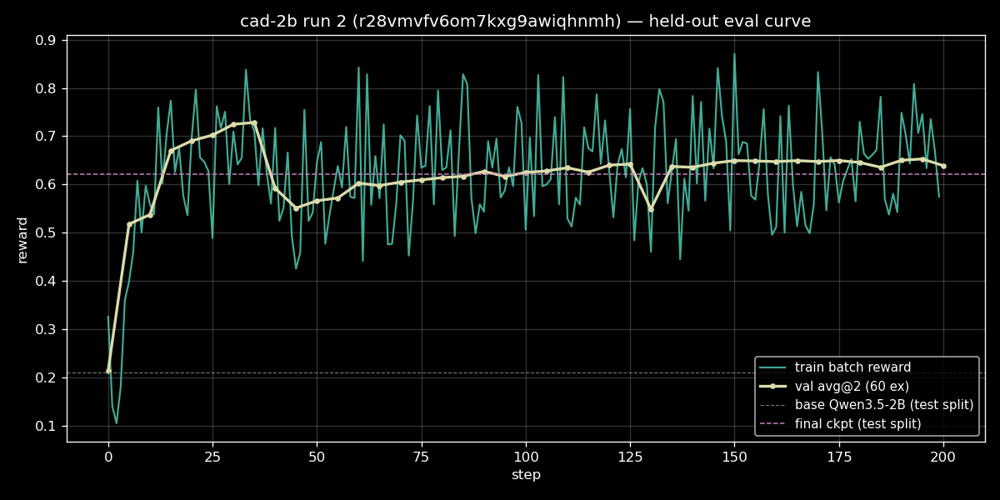

# cad-2b GRPO — run 2 (held-out eval + test-split leaderboard)

**Run id:** `r28vmvfv6om7kxg9awiqhnmh` · **Run name:** `cad-2b-v2` · 2026-06-12

Fixes the two reporting gaps from run 1: (a) no eval-time held-out signal
during training, (b) leaderboard reused the same val split, so there was no
truly out-of-sample comparison. Both fixed: 41-point in-run val curve + a
dedicated test split with OOD shape families, used for both the final-model
score and the cross-model leaderboard.

## Setup

| | |
|---|---|
| Base | `Qwen/Qwen3.5-2B` |
| Algo | GRPO (Prime hosted, compute=M) |
| Steps | 200 |
| Batch / rollouts | 32 examples × 8 rollouts |
| Max tokens | 1536 (no truncation observed in eval) |
| Sampling | `enable_thinking=false`, same for `[eval.sampling]` |
| Difficulty filter | drop batches w/ solve-all > 0.8 or solve-none > 0.2 |
| Env | `ashantanu/cad-env` (compositional, levels 1–4 in train) |
| Train pool | 2000 examples, seed 0 |
| Val (in-run) | 60 examples, seed+1, dedup vs train, levels 1–4, every 5 steps × 2 rollouts |
| Test (post-run) | 60 examples, seed+2, dedup vs train+val, 1-in-3 OOD shapes (level 5) |
| Checkpoints | every 10 steps, 25 retained |
| Cost | ~$0.30 (200 steps + 41 eval rounds) |

## Eval piping (the actual fix)

Run 1 silently emitted zero eval metrics because the config used `[val]`
alone (mechanism A, dead) and `[eval]` with no `[[eval.env]]` sub-block
(mechanism B, no-op). Smoke run 2 armed `[[eval.env]]` and eval *did* fire,
but every score was ~0 with completion lengths up to 55K chars at
`max_tokens=1024`. Cause: `[eval.sampling]` is a **separate config section**
and does not inherit `[sampling]` — `enable_thinking=false` was being
dropped, so eval ran with thinking mode on. Once `[eval.sampling]` was
added, smoke run 3 returned base 0.153 → 0.518 in 10 steps with
completions back under 1024 chars. Then this run.

## Training dynamics — in-run val curve



41 eval points, 60 held-out examples × 2 rollouts each:

| Step | val avg@2 | note |
|---:|---:|---|
| 0 (base) | 0.214 | matches base Qwen3.5-2B on the leaderboard (0.210) |
| 5 | 0.518 | format learning kicks in |
| 35 | **0.728** | peak |
| 40 | 0.592 | drop (likely a bad batch under difficulty filtering) |
| ~65–125 | 0.60–0.64 | recovery + plateau |
| 130 | 0.549 | second dip |
| 145–200 | 0.64–0.65 | stable plateau |
| 200 | 0.639 | final |

**Headline:** the model reaches its peak at step 35 (+0.51 over base) and
then *plateaus, not climbs*. Training past ~35 steps does not improve the
held-out reward. If we'd been watching this curve in run 1 (where we trained
for 100 blind steps), we'd have stopped earlier.

## Final-model on test split — and the leaderboard

After training, the merged adapter was deployed and evaluated on the
held-out test split (60 examples, seed+2, deduped vs train+val, every 3rd
example a level-5 OOD shape family never seen in training). Same protocol
re-run for all 12 leaderboard models on the same test split.

### Test-split leaderboard (`n=30` examples × 4 rollouts = 120)

| Rank | Model | Mean | L1 | L2 | L3 | L4 | L5 (OOD) |
|---:|---|---:|---:|---:|---:|---:|---:|
| 1 | anthropic/claude-haiku-4.5 | 0.957 | 1.00 | 0.97 | 0.87 | 0.92 | 0.98 |
| 2 | deepseek/deepseek-chat | 0.921 | 1.00 | 0.91 | 0.82 | 0.81 | 0.97 |
| 3 | qwen/qwen3-8b | 0.874 | 1.00 | 0.89 | 0.69 | 0.74 | 0.93 |
| 4 | openai/gpt-4.1-mini | 0.816 | 1.00 | 0.73 | 0.75 | 0.61 | 0.88 |
| 5 | google/gemini-2.5-flash-lite | 0.776 | 1.00 | 0.85 | 0.75 | 0.51 | 0.75 |
| 6 | openai/gpt-4.1-nano | 0.734 | 1.00 | 0.75 | 0.66 | 0.50 | 0.71 |
| 7 | mistralai/mistral-small-3.2-24b | 0.723 | 1.00 | 0.72 | 0.55 | 0.60 | 0.69 |
| **8** | **Qwen3.5-2B + GRPO (ours)** | **0.621** | **0.67** | **0.60** | **0.64** | **0.69** | **0.56** |
| 9 | meta-llama/Llama-3.2-1B-Instruct | 0.473 | 0.76 | 0.69 | 0.18 | 0.21 | 0.44 |
| 10 | Qwen/Qwen3.5-9B | 0.401 | 0.88 | 0.43 | 0.32 | 0.07 | 0.30 |
| 11 | Qwen/Qwen3.5-2B (base) | 0.210 | 0.45 | 0.09 | 0.13 | 0.07 | 0.24 |
| 12 | Qwen/Qwen3.5-0.8B | 0.110 | 0.27 | 0.00 | 0.18 | 0.04 | 0.08 |
| 13 | meta-llama/Llama-3.2-3B-Instruct | 0.087 | 0.17 | 0.00 | 0.00 | 0.00 | 0.16 |

### Per-level deltas vs base Qwen3.5-2B

| Level | Base | Trained | Δ |
|---|---:|---:|---:|
| L1 (primitives) | 0.45 | 0.67 | +0.22 |
| L2 (transforms) | 0.09 | 0.60 | **+0.51** |
| L3 (booleans) | 0.13 | 0.64 | **+0.51** |
| L4 (4-op chains) | 0.07 | 0.69 | **+0.62** |
| L5 (OOD shapes) | 0.24 | 0.56 | **+0.32** |
| Overall | 0.210 | 0.621 | +0.411 |

## Reading the leaderboard

- **The trained 2B beats Llama-1B and Qwen3.5-0.8B / 9B / Llama-3B on test.**
  Sits ~0.10 below Mistral-Small-3.2-24B and ~0.11 below gpt-4.1-nano. ~3×
  the base 2B.
- **It's the only model with a flat per-level profile.** Frontier models
  all max out L1 at 1.00 and degrade with composition depth. The trained
  model started weak everywhere (L1=0.45, L4=0.07) and gained the most on
  the hardest in-distribution levels (L2/L3/L4: +0.51, +0.51, +0.62). It is
  best-in-class on L4 except for haiku/deepseek.
- **OOD generalization is real, not vocabulary transfer.** Level 5 contains
  shape families never present in training (torus, triangular prism, slot
  plate, counterbore, cross prism, pyramid, D-shaft). Score went
  0.24 → 0.56 (+132% rel). The model learned compositional CAD primitives,
  not "this description string → that code snippet."
- **In-run val (0.639) matches test (0.621) closely.** Slight test-side
  drop is consistent with the L5 OOD examples being harder than the rest.
- **Qwen3.5-9B (0.40) is a strange outlier** — much worse than 8B. Likely
  a routing / inference artifact on PI, not a real capability gap; worth a
  second look.
- **Llama-3.2-3B at 0.087 is broken** in some way (likely refused or output
  garbage); 1B is fine.

## What we know now that we didn't before

1. Training would have been done at **step 35**, not step 200. Run 3
   should early-stop on a val plateau detector or just cut to 50 steps.
2. The eval-sampling section is its own thing on Prime —
   `[eval.sampling]` must be set explicitly, doesn't inherit `[sampling]`.
3. Prime only converts the **final** training checkpoint into a deployable
   adapter (`step=null`, "merged"), not every retained checkpoint. To get a
   true test-split curve at multiple steps we'd need a separate mechanism
   (export raw weights and serve them ourselves, or ask for that feature).
   For now, the in-run val curve is the curve.
4. Difficulty filtering makes the train-batch reward unreliable as a
   signal — it noticeably drops past step 35 even as val plateaus, because
   the filter is feeding harder and harder examples in.

## Caveats

- Train-batch reward (`reward/all/mean` in the plot) shows mid-run dips
  past step 35 that don't reflect generalization loss; this is the
  difficulty filter at work. Trust the val curve.
- Test set is 60 examples; per-level cells in the leaderboard are
  computed on ~16–40 examples each, so single-cell differences below
  ~0.05 are within noise.
- L5 OOD coverage is 7 shape generators × ~6 examples each. Wider OOD
  sweeps (different cuts, different parameter ranges) would be a more
  honest stress test.

## Reproduce

```bash
# Train
prime train run configs/rl/cad-2b-v2.toml

# Final-model test-split eval
prime deployments create <merged_adapter_id>
PI_API_KEY=... uv run prime eval run cad-env \
  -m "Qwen/Qwen3.5-2B:<merged_adapter_id>" \
  --api-base-url https://api.pinference.ai/api/v1 --api-key-var PI_API_KEY \
  -a '{"eval_split": "test"}' -n 30 -r 4 --max-tokens 2048

# Leaderboard (12 models)
./spikes/run_leaderboard.sh
```

## Next

- Cut a run 3 at 50 steps with the same config + early-stop on val
  plateau, see if we save 75% of the budget for the same result.
- Try a 9B-class base (Qwen3.5-9B starts at 0.40 — there's a lot more
  room to gain).
- Or push the env harder: more OOD shape families, harder dimension
  matching tolerances, multi-turn refinement.
